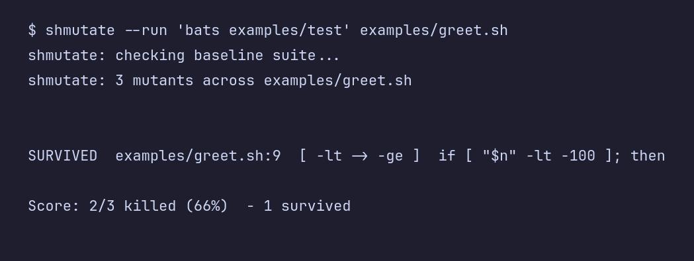

# shmutate

[](https://github.com/darettau/shmutate/actions/workflows/ci.yml)



Mutation testing for shell, for [bats](https://github.com/bats-core/bats-core)
suites. It flips one operator in your code, reruns your tests, and restores the
file. If the tests still pass, nothing was covering that change.

The survivor in that run is a real gap: the line could be wrong and every test
would still pass. I wrote this after a few too many green bats runs gave me false
confidence.

## install

```
install -Dm755 shmutate ~/.local/bin/shmutate
```

Needs bash and awk. Tests run through whatever you pass to `--run`, `bats test`
by default.

## how it works

The suite has to pass first. Then for each operator it flips one at a time and
reruns. A failing test means the mutant was caught; if nothing fails, it
survived. Operators covered:

```
-eq -ne   -lt -ge   -gt -le   -z -n
==  !=    <=  >=     &&  ||     true false
```

and their reverses. Operators inside strings and comments are skipped. Exit is
non-zero when anything survives, so CI can fail on it.

## notes

Quotes and comments are masked with a small scanner, not a real shell parser, so
heredocs and escaped quotes can still fool it. Glued operators like `a&&b` are
left alone. Every mutant reruns the whole suite, so point it at the files that
matter.

## license

MIT, see [LICENSE](LICENSE).
